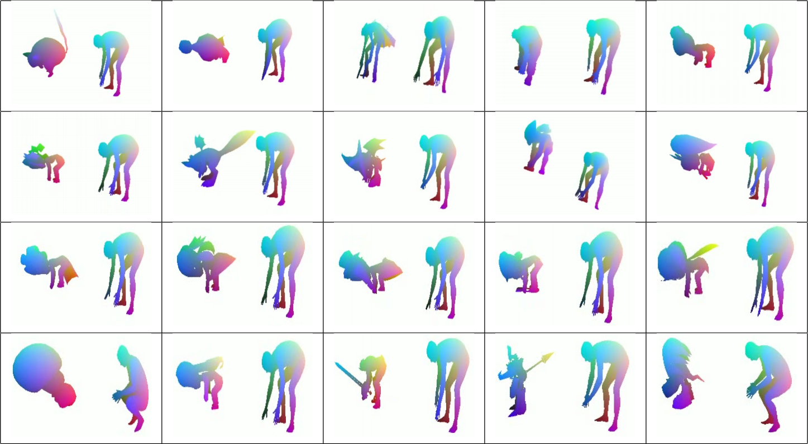
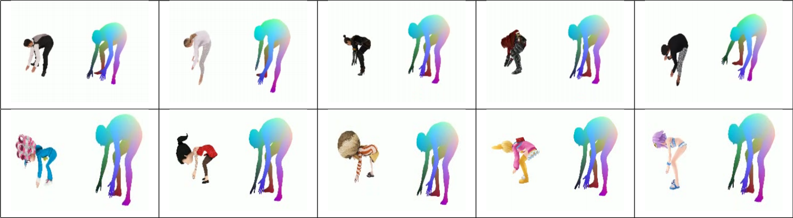

# Pose2Carton 

EE228 课程大作业，利用3D骨架控制3D卡通人物。

# Maya 环境配置

Tutorial: [maya配置教程-知乎](https://zhuanlan.zhihu.com/p/367649237) 

* 申请Autodesk账户和教育版权限，下载maya2020，按引导安装，运行maya2020.
* 添加环境变量：将maya2020\bin的路径添加到环境变量-系统变量-Path中。打开cmd，输入mayapy检查是否添加成功。
* 打开cmd，输入安装pip
>curl https://bootstrap.pypa.io/pip/2.7/get-pip.py -o get-pip.py 
>mayapy get-pip.py
* 安装numpy：
>mayapy -m pip install -i https://pypi.anaconda.org/carlkl/simple numpy
* 检查环境：
>import maya 
>import maya.standalone 
>maya.standalone.initialize(name='python') 
>import maya.OpenMaya as om 
>import maya.cmds as cmds 
>import pymel.core as pm 
>import maya.mel as mel 
>import numpy as np 
>import os 
>import glob
* 在脚本目录下运行示例代码
>mayapy fbx_parser.py xxxx.fbx 
如果顺利结束运行，并生成所需文件，则配置完成。

# 匹配流程

## 代码理解
流程：input -> transfer_one_sequence -> (frame-wise) transfer_given_pose -> output. 
代码的核心函数在于transfer.py脚本中的逐帧transfer_given_pose.

### transfer_one_sequence

使用 transfer.py 脚本时，要将人物模型迁移到 seq_5 序列，调用此函数。它接受两组 input:model.txt 的 riginfo 以及 info_seq_5.pkl 的 pickle 数据存储文件（保存了迁移所需的 vertex parameters，这里应为 rotation vectors）。

函数首先预创建 \_3dmodel 文件夹，用于存储逐帧迁移卡通人物后生成的 obj 序列。随后调用transfer_given_pose，对 seq_5 的每帧生成迁移，得到输出 outinfo 和 outmesh，保存.obj 文件在
\_3dmodel 文件夹。

注意，两组 input 中，riginfo 在 using_online_model = True 时起作用，此函数会调用子进程 \_get_extra_uv_lines 来获得 riginfo 中的 uv_lines 信息，用于决定保存.obj 文件时是以 uv_lines
的形式，还是以 triangles 的形式。

input 中的 info_seq_5.pkl 保存为 human_poses 序列，逐帧迁移时，依序取 human_poses 的 rotation vectors 对卡通人物做 Forward Kinematics，从而得到迁移动作。

### transfer_given_pose
此函数接受三组 input：given pose 的 human_pose 的 24 × 3 rotation vectors，model.txt 的 riginfo 以及 model.obj 的 T-pose mesh。

首先读取 riginfo，为所有 joint 名称建立不重复的 index，保存在 joint2index[name]=index；再按 riginfo 中的先后次序保存 joint 之间的层级，函数里命名为 hier 数组，即 hierarchy(层级) 的缩写；最后重新组织上述 hier 数组，将其整理为一个 kinematic chain(匹配时, 通过输出 joint2index 的一一对应和这些 hierarchy 结构理清关系)。

依次从 riginfo 读取 skin weights 保存在 weight，并读取卡通人物模型的 T-pose skeleton 保存在 joints。

用自行匹配的 manual_model_to_smpl，把 SMPL 模型 joints 挂载至卡通人物模型，这样可以用 SMPL 的 vertex parameters 指导卡通人物做动作。然后用 input 中 human_pose 的 24 × 3 rotation vectors 给上述 joints 做 Forward Kinematics，激动人心地得到 posed character skeleton。

最后一步是根据之前读出的蒙皮权重 weight，获得 posed character 的 mesh。将之前匹配的关节点映射关系存为 outinfo，以.pkl 文件保存在 result 文件夹；迁移姿态完毕的 skeleton 以及随后蒙上的 mesh 存为 outmesh，输出返回给 transfer_one_sequence。

## 匹配操作

### 无蒙皮
* 修改 transfer.py 访问的目标 txt 文件路径，先随意匹配至少10个点，运行代码。代码将输出模型的动力结构树，以及节点命名和编号的对应关系。
* 根据结构树和节点命名匹配此模型和标准模型的节点，并挂载。再次运行 transfer.py.
* 运行 vis.py，生成逐帧 png 和 mp4 文件，得到可视化结果。如果动作和标准人形相同，匹配成功。

### 有蒙皮
* 从网络下载带有贴图的 fbx 文件，运行 mayapy 的 fbx_parser.py 生成对应的 obj、txt、fbm、mtl 文件，分别保存 T-pose mesh、riginfo、texture、材质库。
* 匹配流程与无蒙皮部分相同。
* 为了使可视化结果带有贴图，将贴图 png 信息加入 mtl 文件，把对应的 mtl 和 png 放入 transfer.py 生成的 _3dmodel 文件夹中。
* 运行 vis.py，获得可视化结果。

# 项目结果

有蒙皮：

无蒙皮：

# 协议 
本项目在 Apache-2.0 协议下开源

所涉及代码及数据的最终解释权归倪冰冰老师课题组所有

Group 30
